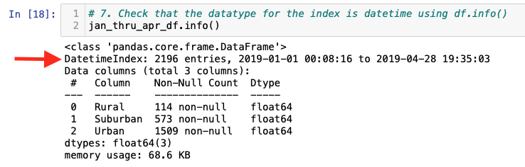
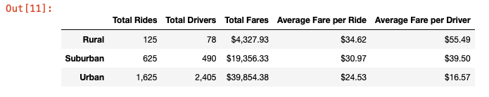
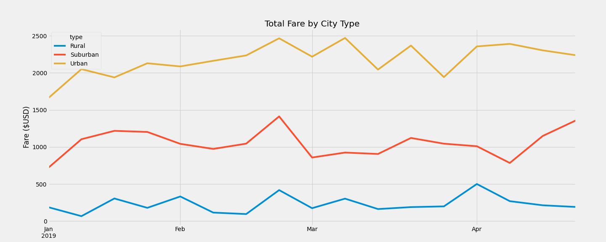

# PyBer Analysis

## Project Overview

PyBer, a python-based ride-sharing company, has hired us as data analysts to help improve access to ride-sharing services and determine affordability for underserved neighborhoods.

After conducting a series of analysis on the ride-sharing data, V. Isualize has requested we: 

* present a summary DataFrame of the ride-sharing data by city type. 
* present a multiple-line graph that shows the total weekly fares for each city type.
*  report how the data differs by city type and how those differences can be used by decision-makers at PyBer.

## Methodology

Using *jupyter notebook*, we inspected the data contained in the *city_data.csv* and *ride_data.csv* files, and merged the data into a new DataFrame, *pyber_data_df*, which we used as the basis for our analysis. 

Using the *Pandas*, *Numpy* and *Matplotlib* libraries, we conducted our preliminary analysis, producing several charts and plots which are included in the accompanying *analysis* folder to this report.

We also used the *pivot* and *datetime* methods to re-arrange the data and resample the dates by week, after confirming that the the data type was in the correct format, as shown in the section of code highlighted below.

## Results

The following presents the requested ride-sharing summary DataFrame, showing for each city type:

* the total number of rides
* the total number of drivers
* the sum of all fares
* the average fare per ride
* the average fare per driver

In addition to the summary DataFrame, below is a line graph showing weekly total fare by city types for the first four months of 2019, from the beginning of january through the end of april.

## Summary and Recommendations

From the summary DataFrame and line graph presented above, it is evident that the rural cities have fewer rides and total drivers, yet the average fare per ride and per driver is much higher than that for urban or suburban cities. This may be due to higher competition between ride-hailing platforms and drivers in the urban cities, which forces fares to be lower (i.e. more competitive). From the summary DataFrame, one can see that for urban cities, there are 1.48 drivers competing for each ride, whereas in the suburban cities, there are only 0.78. In the case of the rural cities, this number drops further to 0.62.

Rural cities, and to a lesser degree suburban cities, are being underserved in terms of number of drivers, causing the average fare per ride and fare per driver to be much higher. 

Based on our findings, we are presenting the following recommendations in order to address these disparities:

* Launch a hiring initiave for drivers in rural and suburban cities.
* Provide incentives for drivers in overserved urban cities to relocate to underserved rural and suburban cities.
* Provide an incentive fare structure for drivers when servicing rides originating in one city type and ending in another city type (ex. urban to rural or suburban to urban, etc.).
